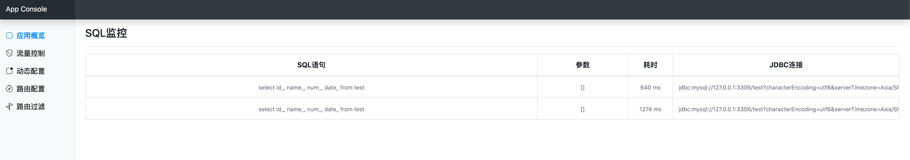

# app-console
[](https://github.com/icodening/app-console)
[](https://github.com/icodening/app-console)

一款Spring Boot无侵入式应用管理框架.

# Features
>1. 对原有代码无任何侵入，亦不需要额外添加依赖
>2. 控制台提供RESTful OpenAPI，可自行定制UI
>3. 对应用提供基于分组、集群、实例等多管理维度的流量控制，可实现分组限流、集群限流、实例限流
>4. 对应用实例提供并发控制管理
>5. 对应用内部路由进行管理控制(应用需要基于Spring Cloud)  
>6. 对应用环境变量修改并实时生效 
>7. 在线实时查看应用日志
>8. 可对实例SQL进行监控

``注: 该项目仅供学习使用,不可用于生产,且功能较为简单,等待后续扩展``
# Build 
````shell script
mvn package  
````
运行命令后将会在console-dist/target下生成一个app-console-bin.tar.gz的文件, 压缩包结构如下

````
|____server
| |____app-console-server.jar           管控端程序入口
| |____application.yml                  管控端配置文件
|____agent
| |____config
| | |____config.properties              agent配置文件
| |____extensions                       agent扩展包
| | |____**more**.jar                   
| |____console-agent.jar                agent
````

# Usage

> 1. 使用 mvn package 命令构建
> 2. 进入 console-dist/target 目录
> 3. 解压 app-console-bin.tar.gz
> 4. 使用命令启动 java -jar server/app-console-server.jar
> 5. 在自己的Spring Boot应用中添加一句启动参数 -javaagent:/agent/console-agent.jar 即可，例如  
>    java -javaagent:/agent/console-agent.jar -jar myapp.jar  
> 6. 浏览器打开 localhost:28080 即可进入应用控制台，当能在该页面上看到自己的应用时则视为成功

# Agent Config
````
#Agent连接的控制台后端地址
serverAddress=http://127.0.0.1:28080 
````

# Screenshot
#### 配置应用启动参数: -javaagent:/xxx/console-agent.jar


#### 应用完整依赖与启动日志


#### 应用注册成功后将会在此显示


#### 查看应用日志, 直接点击"查看日志"按钮即可


#### 查看SQL记录, 直接点击"SQL监控"按钮即可


#### 流量控制配置, 下图表示限制AppConsoleDemo应用的/echo访问频率上限为每秒1次


#### 动态配置(支持Nacos SpringBoot及Nacos SpringCloud)
当不对接Nacos Config Center时，会自带有一个极其轻量配置中心，亦可动态刷新@Value的配置。   
下图表示配置AppConsoleDemo应用中，key为env的配置项.  
``注: 对接第三方配置中心时并不会回显第三方配置中心的配置，但修改时会同步发布配置到对应的第三方配置中心``


#### Spring Cloud 测试应用依赖及启动日志
如图，Spring Cloud环境下将会启用一些独有功能

#### 路由配置(支持RestTemplate, OpenFeign)

满足配置条件的情况如下

不满足配置条件的情况如下


#### 路由过滤(支持Nacos、Eureka，支持RestTemplate、OpenFeign调用方式)

满足条件的调用结果

不满足条件的调用结果

# PS
1. 仅支持基于SpringBoot 2.0.0.RELEASE及以上版本开发Servlet Web应用, 暂不支持Reactive应用
2. 在Spring环境下, 标识有@Extension接口的实现将被Spring容器接管，将享有Spring的特性。
3. 不适用于传统基于Tomcat直接部署war包类型的项目
